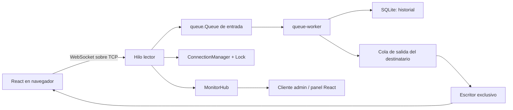

# Chat Multicliente con Procesamiento Concurrente

Proyecto 1 de Cómputo Paralelo y Distribuido, Universidad Autónoma de Chihuahua.

Aplicación de chat en tiempo real con múltiples clientes concurrentes. El
servidor está escrito en Python y utiliza sockets TCP, WebSocket implementado
manualmente, `threading`, `threading.Lock`, `queue.Queue` y SQLite. La interfaz
web está escrita en React.

## 1. Cumplimiento del enunciado

La matriz completa, con la evidencia técnica de cada requisito, está en
[`docs/REQUISITOS_MAESTRO.md`](docs/REQUISITOS_MAESTRO.md).

| Área solicitada | Implementación actual |
| --- | --- |
| Servidor multicliente | `socket.accept()` crea un hilo lector y un escritor exclusivo por conexión. |
| Mensajes | Broadcast, privados, grupos y entrega en tiempo real mediante WebSocket sobre TCP. |
| Interfaz | React para login, registro, conversaciones, archivos, grupos y monitor administrativo. |
| Archivos | Base64 dentro de JSON, límite de 5 MiB, validación por bloques y entrega privada o general. |
| Concurrencia | Hilos por conexión, worker de mensajes, colas de salida y `MonitorHub`. |
| Sincronización | Locks para sesiones compartidas y una cola de salida por conexión. |
| Persistencia | Usuarios, perfiles e historial de mensajes en SQLite. |
| Seguridad | PBKDF2-SHA256 para cuentas nuevas, roles `user`/`admin`, sesiones duplicadas rechazadas. |
| Rendimiento | Pruebas de carga, RTT y comparación controlada entre hilos y procesos. |

## 2. Arquitectura



### Flujo de una conexión

1. `tcp_server.py` acepta un socket TCP y crea el hilo de cliente.
2. `websocket_handler.py` completa el handshake y procesa frames WebSocket.
3. El hilo lector valida JSON, autenticación y archivos.
4. `message_queue_manager.py` entrega el mensaje a un worker compartido.
5. El worker guarda el mensaje en SQLite y resuelve sus destinatarios.
6. Cada `Connection` usa una cola y un único hilo escritor para evitar frames
   mezclados y aislar clientes lentos.

El administrador se autentica con el rol `admin`, recibe el snapshot del
monitor, eventos y estadísticas, pero no aparece en la lista de usuarios ni
participa en el chat.

En régimen estable, con `C` usuarios y `A` administradores autenticados, se
esperan aproximadamente `2 x (C + A) + 4` hilos: lector y escritor por
conexión, hilo principal, worker de mensajes, distribuidor del monitor y
muestreador de estadísticas. Las conexiones aún no autenticadas pueden elevar
temporalmente la cifra.

## 3. Requisitos

- Python 3.11 o superior.
- Node.js y npm para la interfaz web.
- Linux, macOS o Windows con soporte para sockets TCP.
- `websockets` solo es necesario para los clientes y scripts de prueba.
- `psutil` es opcional; el monitor tiene una alternativa basada en la biblioteca
  estándar.

## 4. Instalación y ejecución

Desde la raíz del repositorio:

```bash
python -m venv .venv
source .venv/bin/activate
python -m pip install -r scripts/requirements.txt
```

En Windows:

```powershell
.venv\Scripts\activate
```

### Crear usuarios de prueba

```bash
export CHAT_ADMIN_PASSWORD='clave-admin-local'
python scripts/seed_users.py --count 20
```

El seed crea `admin` y `user01` hasta `user20`. Las cuentas de usuario usan
`test1234`; la cuenta admin usa `CHAT_ADMIN_PASSWORD`. Si no se define esa
variable, el valor local de respaldo es `admin123`. Repetir el seed es seguro:
no duplica usuarios ni cambia contraseñas o roles existentes.

### Iniciar el backend

```bash
source .venv/bin/activate
python backend/main.py --host 0.0.0.0 --port 5001
```

Configuración disponible:

| Opción | Predeterminado | Variable de entorno |
| --- | --- | --- |
| Host | `0.0.0.0` | `CHAT_HOST` |
| Puerto | `5000` | `CHAT_PORT` |
| Base SQLite | `backend/chat.db` | `CHAT_DB_PATH` |
| Directorio de logs | `logs/` | `CHAT_LOG_DIR` |

Los argumentos tienen prioridad. El servidor anuncia la IP LAN detectada. Para
conectarse desde otro equipo se usa esa IP, nunca `0.0.0.0` ni `localhost`.

### Iniciar el frontend

En otra terminal:

```bash
cd newfront/miapp
npm install
npm run dev -- --host 0.0.0.0
```

Vite mostrará la URL local y la URL de red. El cliente WebSocket usa el puerto
`5001` por defecto en `src/services/socket.js`, para coincidir con la ejecución
recomendada. Se puede cambiar sin modificar código:

```bash
VITE_WS_PORT=5000 npm run dev -- --host 0.0.0.0
```

También se puede definir `VITE_WS_URL=ws://192.168.1.10:5001` en un archivo
`.env` dentro de `newfront/miapp`.

## 5. Uso de la aplicación

### Usuarios normales

Iniciar sesión con `user01` / `test1234` o registrar una cuenta nueva. La
interfaz permite:

- sala general y mensajes privados;
- grupos creados desde el cliente;
- transferencia de archivos de hasta 5 MiB;
- perfiles con avatar y descripción;
- notificaciones, no leídos y confirmaciones de lectura;
- historial de mensajes recuperado desde SQLite al volver a iniciar sesión.

Los mensajes privados y grupales se guardan aunque el destinatario esté
desconectado. El historial conserva los últimos 500 mensajes visibles para cada
usuario. Los archivos se guardan dentro del mensaje como base64, por lo que el
tamaño de la base SQLite puede crecer rápidamente durante pruebas con archivos.

### Administrador y monitor

Iniciar sesión con `admin` y la contraseña configurada. El administrador ve:

- usuarios conectados;
- número de hilos y tamaño de la cola;
- mensajes por segundo, bytes, CPU y memoria;
- eventos de conexión, autenticación, mensajes, archivos y errores;
- las últimas 200 entradas del buffer de logs.
- pestaña de usuarios para crear, editar y eliminar cuentas;
- pestaña de grupos para crear, editar integrantes y eliminar grupos.

El monitor muestra metadatos y nunca registra contraseñas, textos privados ni
contenido base64.

Las operaciones administrativas se validan también en el backend. Una cuenta
normal no puede invocarlas y un administrador no puede eliminar su propia
cuenta.

## 6. Cliente de consola

```bash
python scripts/cli_client.py --host 127.0.0.1 --port 5001 --username user01
python scripts/cli_client.py --host 127.0.0.1 --port 5001 --username admin
```

La contraseña se solicita sin mostrarla. Comandos disponibles para usuarios:

```text
/w user02 Hola, este es un mensaje privado
/todos Hola a todos
/salir
```

El cliente admin muestra snapshots, eventos y estadísticas. Es útil para
demostrar el backend aunque no se quiera abrir la interfaz React.

## 7. Pruebas

### Comprobaciones rápidas

```bash
python -m compileall -q backend scripts
cd newfront/miapp
npm run build
```

### Pruebas del backend y del protocolo

```bash
python scripts/test_database.py
python scripts/test_concurrency.py
python scripts/test_logging.py
python scripts/test_monitor.py
python scripts/test_regression.py
```

Las pruebas usan bases y logs temporales para no contaminar la instalación
local.

### Carga y rendimiento

```bash
python scripts/test_network.py
python scripts/test_load.py
python scripts/bench_threads_vs_processes.py
python scripts/test_final.py
```

La prueba final documentada usa 20 usuarios, un administrador, 30 segundos,
dos mensajes de carga y dos sondas RTT por usuario y segundo, además de un
archivo de 5 MiB. La evidencia y sus limitaciones están en
[`docs/RESULTADOS_FINALES.md`](docs/RESULTADOS_FINALES.md).

## 8. Persistencia y datos generados

- `backend/chat.db`: usuarios, perfiles e historial de mensajes.
- `logs/server.log`: eventos técnicos del servidor.
- `newfront/miapp/localStorage`: sesión, contactos, grupos, no leídos y
  preferencias del navegador.

No se deben subir credenciales, bases de prueba ni logs con información real.
Para una prueba aislada se puede usar `CHAT_DB_PATH` apuntando a otra base.

## 9. Documentación del repositorio

El orden recomendado de lectura está en [`docs/INDICE.md`](docs/INDICE.md).
Los documentos principales son:

- [`docs/REQUISITOS_MAESTRO.md`](docs/REQUISITOS_MAESTRO.md): relación directa
  con el enunciado y evidencia de cumplimiento.
- [`docs/PROTOCOLO_MENSAJES.md`](docs/PROTOCOLO_MENSAJES.md): contrato JSON
  entre frontend, cliente CLI y backend.
- [`docs/RESULTADOS_FINALES.md`](docs/RESULTADOS_FINALES.md): prueba T10,
  resultados y limitaciones.
- [`docs/HILOS_VS_PROCESOS.md`](docs/HILOS_VS_PROCESOS.md): microbenchmark y
  análisis de la elección de concurrencia.
- [`docs/CAMBIOS_PARA_REPORTE.md`](docs/CAMBIOS_PARA_REPORTE.md): guía para
  redactar el reporte académico.
- [`docs/VALIDACION_T2_T5.md`](docs/VALIDACION_T2_T5.md): evidencia histórica
  de la validación intermedia.

## 10. Alcance y limitaciones

El proyecto demuestra los requisitos académicos solicitados. No pretende ser
un servicio de producción: no incluye TLS, recuperación de contraseña,
moderación, almacenamiento de archivos externo ni alta disponibilidad. El
rendimiento documentado corresponde a las máquinas, versiones y condiciones
indicadas en cada evidencia; no garantiza los mismos resultados en cualquier
red o hardware.
