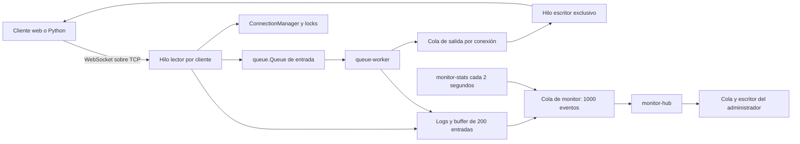

# Sistema de Chat Multicliente con Procesamiento Concurrente

Proyecto 1 de Cómputo Paralelo y Distribuido, Universidad Autónoma de Chihuahua.
Chat con registro, login, mensajes privados, difusión y archivos de hasta 5 MiB.
Servidor Python con sockets TCP, hilos, locks, colas y SQLite; interfaz React.

## Arquitectura actual

El navegador habla WebSocket. El servidor implementa el handshake y los frames
manualmente en `backend/websocket_handler.py` sobre `socket.socket()` TCP.
No utiliza frameworks ni asyncio en el servidor.

Cada conexión tiene un hilo lector y, después del handshake, un hilo escritor.
Todos los envíos pasan por `Connection.send()` y su cola de salida de hasta
1000 mensajes. Solo el escritor llama a `send_frame`; una salida saturada cierra
ese cliente. El worker de entrada resuelve destinos y encola sin esperar a que
el destinatario lea del socket.

La validación base64 se realiza por bloques en el lector del emisor, antes de
encolar el archivo. El escritor serializa sus metadatos e inserta el base64 ya
validado; el desenmascarado WebSocket usa tablas de traducción por bloques.
Estas operaciones evitan ocupar el worker compartido con el contenido grande.



El administrador se autentica con SQLite y recibe un snapshot, eventos y
estadísticas. No aparece en `user_list`, no recibe mensajes de chat ni archivos
y no participa en broadcasts. El monitor descarta eventos antiguos al llenarse
su cola. El log contiene metadatos, nunca textos del chat ni contraseñas.

Con C usuarios y A administradores autenticados, sin conexiones pendientes,
los hilos esperados son **2 × (C + A) + 4**: lectores/escritores más principal,
worker de mensajes, distribuidor del monitor y muestreador. Los handshakes o
conexiones aún sin autenticar pueden aumentar temporalmente esa cifra.

Las contraseñas nuevas usan PBKDF2-SHA256 con 600 000 iteraciones y sal aleatoria.
Las cuentas antiguas con SHA-256 siguen funcionando. La migración añade `role`
sin perder datos; un registro web siempre crea un usuario normal. Un segundo
login no reemplaza una sesión existente.

## Ejecución local

Desde la raíz del proyecto, con Python 3.11 o superior:

```bash
python -m venv .venv
source .venv/bin/activate
python -m pip install -r scripts/requirements.txt
export CHAT_ADMIN_PASSWORD='elige-una-clave-local'
python scripts/seed_users.py --count 20
python backend/main.py
```

`websockets` se necesita para los clientes de `scripts/`, no para el servidor.
El servidor funciona con la biblioteca estándar; `psutil` es opcional para
estadísticas de CPU y RSS actual. Sin él utiliza `time.process_time()` y
`resource.getrusage()` (RSS máximo).

El seed crea `admin` y `user01`…`user20`. La contraseña de los usuarios de
prueba es `test1234`; la de admin se toma de `CHAT_ADMIN_PASSWORD`, o `admin123`
si no se define (solo pruebas locales). Repetir el seed no duplica ni cambia
contraseñas o roles existentes. `--count` controla la cantidad de usuarios.

| Configuración | Valor predeterminado | Alternativa |
|---|---|---|
| Host | `0.0.0.0` | `--host` o `CHAT_HOST` |
| Puerto | `5000` | `--port` o `CHAT_PORT` |
| SQLite | `backend/chat.db`, ruta absoluta | `CHAT_DB_PATH` |
| Logs | `logs/server.log` desde la raíz | `CHAT_LOG_DIR` cambia el directorio |

Los argumentos tienen prioridad sobre las variables de entorno. Ejemplos:

```bash
python backend/main.py --host 0.0.0.0 --port 5001
CHAT_HOST=127.0.0.1 CHAT_PORT=5001 python backend/main.py
```

Al arrancar se anuncia la IP LAN detectada y el puerto. `0.0.0.0` permite
escuchar en las interfaces locales; para conectarse se utiliza la IP real del
servidor, no `0.0.0.0`.

## Cliente de consola y administrador

En otra terminal con el mismo entorno virtual:

```bash
python scripts/cli_client.py --username user01
python scripts/cli_client.py --username admin
```

La contraseña se solicita sin mostrarla. Comandos del usuario: `/w user02 Hola`,
`/todos Hola a todos`, `/salir`. El administrador ve el JSON del snapshot,
eventos y estadísticas automáticamente. La interfaz React del monitor se
implementa por separado contra el contrato del backend.

## Interfaz web

```bash
cd newfront/miapp
npm install
npm run dev
```

La interfaz actual conecta a `ws://localhost:5000` desde
`newfront/miapp/src/services/socket.js`. Si se cambia el puerto o se ejecuta el
navegador en otra computadora, quien desarrolla la interfaz debe configurar
esa URL con el host/puerto del servidor. Esta fase modifica el backend y los
scripts; no añade la pantalla administrativa de React.

## Pruebas desde otra computadora

1. En la computadora servidor: sembrar usuarios, ejecutar
   `python backend/main.py --host 0.0.0.0 --port 5000` y tomar la IP LAN anunciada.
2. En la otra computadora: disponer del proyecto y de `websockets` mediante
   `pip install -r scripts/requirements.txt`; ambas deben tener conectividad
   entre sí y el puerto TCP elegido debe estar permitido por el firewall.
3. Abrir usuarios reales con el cliente de consola o la interfaz configurada:
   `python scripts/cli_client.py --host 192.168.1.10 --username user01`.
4. Para carga, reservar `user01`…`user20` al script y usar cuentas diferentes
   para las personas; los logins duplicados se rechazan.

```bash
python scripts/cli_client.py --host 192.168.1.10 --username admin
python scripts/load_test.py --host 192.168.1.10 --port 5000 --users 20 --duration 30 --rate 2 --file-mb 5 --output resultado.json
```

Reemplazar `192.168.1.10` por la IP real. Las claves y el tráfico son para una
red de demostración: TLS no forma parte de esta fase.

## Carga, RTT y evidencia

`load_test.py` mantiene R mensajes de carga y R sondas de retorno por segundo
por usuario; uno de cada cinco mensajes de carga es broadcast. Las sondas son
mensajes privados al propio usuario con marca de tiempo monotónica del mismo
proceso cliente, por lo que no se sincronizan relojes entre computadoras.
Cuando hay archivo, sus dos participantes se atienden en un bucle/hilo aparte
del cliente de carga, para que su enmascarado no detenga las sondas de los demás.
Esta separación corresponde al script; el servidor sigue usando threading.

El script comprueba contenido, orden, remitentes, destinatarios, duplicados,
pérdidas e integridad SHA-256 del archivo. Los enviados cuentan mensajes y los
recibidos cuentan entregas, incluyendo cada destinatario de un broadcast.
Reporta RTT p50/p95/máximo y compara los usuarios ajenos al archivo durante su
transferencia y fuera de ella. La ventana va del inicio de envío al frame
completo recibido; una sonda se incluye si su intervalo coincide con esa ventana.
`null` y cero muestras indican que no hubo datos para estimar un percentil.
El JSON identifica si el cliente usa la máscara Python o la extensión `speedups`.
La corrida final utilizó la extensión C opcional de websockets 15.0.1; los
primeros intentos usaron su alternativa Python. Los resultados documentan
ambos entornos y el número de muestras, sin atribuir toda la mejora al servidor.

```bash
python scripts/test_network.py
python scripts/test_load.py
python scripts/bench_threads_vs_processes.py
python scripts/test_final.py
```

Las pruebas automatizadas usan servidores y bases temporales y los eliminan
al terminar. El microbenchmark crea procesos con `spawn` y compara N=10 y N=20
una vez por configuración; no representa el chat completo. En Linux mide RSS
actual; en macOS utiliza RSS máximo de `resource`.

- [Protocolo completo y monitor](docs/PROTOCOLO_MENSAJES.md).
- [Validación integrada T2–T5](docs/VALIDACION_T2_T5.md).
- [Hilos vs. procesos](docs/HILOS_VS_PROCESOS.md).
- [Prueba final T10](docs/RESULTADOS_FINALES.md).
- [Cambios para el reporte académico](docs/CAMBIOS_PARA_REPORTE.md).

## Escalabilidad histórica anterior a T2

Los siguientes resultados ya estaban documentados y no se repitieron en esta
fase. Corresponden a un solo hilo por cliente y sin MonitorHub; su fórmula
N+2 no describe el servidor actual con escritor dedicado.

| Clientes | Conexión total | Promedio primer broadcast | Mensajes recibidos | Errores | Hilos |
|---|---:|---:|---:|---:|---:|
| 1 | 0.796 ms | N/D | 0 | 0 | 3 estimados |
| 5 | 2.148 ms | 24.812 ms | 20 | 0 | 7 estimados |
| 10 | 3.803 ms | 9.732 ms | 90 | 0 | 12 medidos |
| 25 | 8.177 ms | 6.461 ms | 600 | 0 | 27 medidos |
| 50 | 14.936 ms | 33.331 ms | 2450 | 0 | 52 medidos |

## Archivos principales

- `backend/`: servidor TCP, WebSocket manual, gestión de clientes, colas,
  SQLite, `server_log.py` y `monitor_hub.py`.
- `scripts/`: seed, cliente CLI, carga, comparación hilos/procesos y pruebas.
- `newfront/miapp/`: interfaz React.
- `docs/`: contrato de mensajes, evidencias y guía del reporte.

El proyecto demuestra sockets TCP, hilos por conexión, sincronización con
locks, colas, manejo de errores, autenticación, GUI y evaluación de rendimiento.
Salas, historial persistente y TLS siguen fuera del alcance de esta fase.
